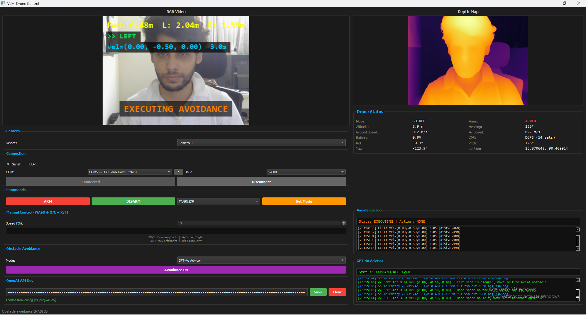
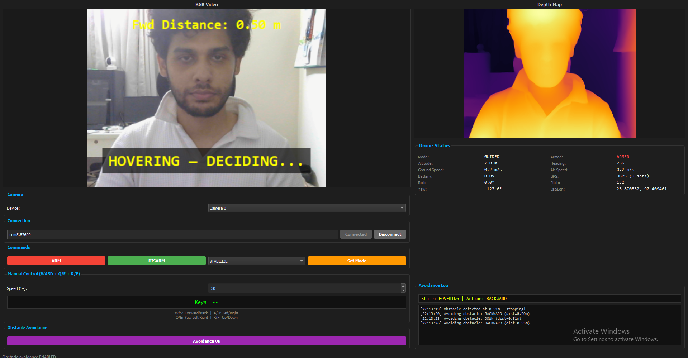

<h1 align="center">Vision-Language Guided Autonomous Drone</h1>

<h3 align="center">Multimodal Perception and Natural Language Command Execution via GPT-4</h3>

<p align="center">
  
  
  
  
  
</p>

<p align="center">
  <em>A research-grade Ground Control Station integrating large vision-language models with real-time UAV control</em>
</p>

<p align="center">
  <a href="#-overview">Overview</a> &nbsp;&bull;&nbsp;
  <a href="#-key-features">Features</a> &nbsp;&bull;&nbsp;
  <a href="#-system-architecture">Architecture</a> &nbsp;&bull;&nbsp;
  <a href="#-demo">Demo</a> &nbsp;&bull;&nbsp;
  <a href="#-installation">Install</a> &nbsp;&bull;&nbsp;
  <a href="#-usage">Usage</a> &nbsp;&bull;&nbsp;
  <a href="#-citation">Cite</a>
</p>

---

## Overview

This project presents a **Vision-Language Model (VLM) guided autonomous drone system** that couples the semantic reasoning capabilities of GPT-4 with real-time multimodal perception -- including monocular depth estimation and live camera feeds -- to enable natural language-driven UAV navigation and situational awareness.

The system is designed as a modular, extensible Ground Control Station (GCS) that bridges the gap between high-level human intent and low-level flight commands. By integrating OpenAI's GPT-4 as a decision-making agent with onboard perception pipelines (Depth Anything V2), the drone can interpret environmental depth, assess spatial clearance, and autonomously issue MAVLink commands -- all within a real-time PyQt5 interface.

This work sits at the intersection of **autonomous systems**, **multimodal AI**, and **human-robot interaction**, and is intended to serve as a reproducible research prototype for the robotics and AI community.

---

## Problem Statement

<table>
<tr>
<td width="50%">

### The Challenge

GPS-guided autonomous drone missions assume unobstructed flight paths between waypoints. In real-world environments, unexpected obstacles -- trees, buildings, wildlife, vehicles -- can appear in the planned trajectory.

Current solutions rely on **expensive dedicated sensors**:
- LiDAR modules: ~$500+
- Stereo depth cameras: ~$200+
- Ultrasonic arrays: ~$100+

</td>
<td width="50%">

### Our Approach

We demonstrate that a **$10 USB webcam** combined with:

1. **Transformer-based monocular depth estimation** (Depth Anything V2, 24.8M parameters)
2. **Large language model reasoning** (GPT-4o) interpreting numerical sensor data
3. **Spatial depth analysis** (left/center/right region percentile estimation)

...can provide effective reactive obstacle avoidance during autonomous waypoint missions, at a fraction of the cost.

</td>
</tr>
</table>

---

## Key Features

<table>
<tr>
<td width="33%" align="center">
<h4>Monocular Depth Perception</h4>
<p>Depth Anything V2 Small running at 3 FPS on CPU. Dense depth maps from a single RGB camera with spatial region analysis (L/C/R).</p>
</td>
<td width="33%" align="center">
<h4>GPT-4 Decision Engine</h4>
<p>Real-time telemetry and depth readings sent to GPT-4o. Returns velocity commands with natural language reasoning and safety constraints.</p>
</td>
<td width="33%" align="center">
<h4>Mission-Aware Avoidance</h4>
<p>Seamless AUTO/GUIDED transitions during waypoint missions. 6-state machine with clearance phase prevents obstacle re-encounter.</p>
</td>
</tr>
<tr>
<td width="33%" align="center">
<h4>Interactive Mission Planning</h4>
<p>Leaflet-based map with click-to-add waypoints, drag-to-reposition, satellite/dark view toggle, and .waypoint file I/O.</p>
</td>
<td width="33%" align="center">
<h4>Dual Avoidance Modes</h4>
<p>Auto (logic-based spatial analysis) and GPT-4o (LLM reasoning) modes with automatic fallback between them on failure.</p>
</td>
<td width="33%" align="center">
<h4>Full GCS Functionality</h4>
<p>Telemetry, manual WASD control, ARM/DISARM, mode switching, motor PWM monitoring, serial/UDP connection with auto-detection.</p>
</td>
</tr>
</table>

---

## System Architecture

```
                               ┌─────────────────────┐
                               │   USB Camera (RGB)   │
                               │     320 x 240        │
                               └──────────┬───────────┘
                                          │
                                     30 FPS capture
                                          │
                               ┌──────────▼───────────┐
                               │  Depth Anything V2   │
                               │  Small (24.8M params)│
                               │  Inference @ 3 FPS   │
                               └──────────┬───────────┘
                                          │
                                 Dense Depth Map (H×W)
                                          │
                          ┌───────────────┼───────────────┐
                          │               │               │
                     Left Third      Center 20%     Right Third
                     (distance)    (75th percentile)  (distance)
                          │               │               │
                          └───────┬───────┴───────┬───────┘
                                  │               │
                           forward_dist    spatial_clearance
                                  │               │
                     ┌────────────▼───────────────▼────────────┐
                     │       Avoidance State Machine           │
                     │                                         │
                     │  IDLE ──▶ DETECTED ──▶ HOVER (1.5s)    │
                     │    ▲                       │            │
                     │    │                       ▼            │
                     │  CLEARANCE (4s) ◀── EXECUTING (2-5s)   │
                     │                                         │
                     └────────┬──────────────────┬─────────────┘
                              │                  │
                         Auto Mode          GPT-4o Mode
                        (local logic)       (API call)
                              │                  │
                              └────────┬─────────┘
                                       │
                                Velocity Command
                              (vx, vy, vz, duration)
                                       │
                          ┌────────────▼────────────┐
                          │   MAVLink (pymavlink)    │
                          │   Serial / UDP / TCP     │
                          └────────────┬────────────┘
                                       │
                          ┌────────────▼────────────┐
                          │   ArduPilot Autopilot    │
                          │   (Pixhawk / SITL)       │
                          └─────────────────────────┘
```

### Avoidance State Machine

| State | Duration | Description |
|:------|:---------|:------------|
| `IDLE` | -- | Monitoring forward depth. No obstacle detected. |
| `OBSTACLE_DETECTED` | instant | Force-switch to GUIDED mode (5 retries with verification). |
| `HOVERING` | 1.5s min | Stabilize + compute avoidance decision (Auto or GPT-4o). |
| `EXECUTING` | 2-5s | Execute velocity maneuver (direction based on spatial clearance). |
| `COMPLETED` | instant | Check if obstacle cleared. Retry if still blocked. |
| `CLEARANCE` | 4s | Fly **forward past** the obstacle before resuming mission. |

> The **clearance phase** is critical: without it, the drone avoids laterally, resumes AUTO, and flies back into the same obstacle -- creating a deadlock.

---

## Demo

<p align="center">
  <em>Video demonstration coming soon</em>
</p>

<!--
[](https://youtu.be/YOUR_VIDEO_ID)
-->

| Executing Avoidance | Hovering — Deciding | GCS Control Interface |
|:-:|:-:|:-:|
|  |  |  |

*Left: Drone actively executing an avoidance maneuver with RGB feed and depth map. Center: VLM hovering while GPT-4o decides the next action. Right: Full GCS showing collision warning, directional controls, and live telemetry.*

---

## Technologies Used

| Layer | Technology | Version | Purpose |
|:------|:-----------|:--------|:--------|
| **Interface** | PyQt5 + PyQtWebEngine | 5.15+ | Desktop GCS application |
| **Depth Model** | Depth Anything V2 Small | HuggingFace | Monocular depth estimation (24.8M params) |
| **Inference** | PyTorch (CPU) | 2.6.0 | Deep learning model backend |
| **Language Model** | OpenAI GPT-4o | API v1 | Intelligent avoidance reasoning |
| **Drone Protocol** | pymavlink (MAVLink 2.0) | 2.4.x | Bidirectional drone communication |
| **Computer Vision** | OpenCV | 4.8+ | Camera capture + image processing |
| **Map Rendering** | Leaflet.js + CartoDB/ESRI | 1.9.4 | Interactive waypoint planning |
| **Flight Controller** | ArduPilot ArduCopter | 4.x | Autopilot firmware |

---

## Folder Structure

```
VLM-RME/
├── main.py                           # Application entry point
├── requirements.txt                  # Python dependencies
├── README.md
│
├── app/
│   ├── main_window.py                # QTabWidget orchestration (Control + Mission tabs)
│   │
│   ├── drone/                        # ── Flight Control & Planning ──
│   │   ├── mavlink_comm.py           # MAVLink connection, telemetry, mission protocol
│   │   ├── avoidance.py              # 6-state avoidance state machine
│   │   └── mission.py                # Waypoint dataclass + .waypoint file I/O
│   │
│   ├── vision/                       # ── Perception Pipeline ──
│   │   ├── camera.py                 # USB camera capture (320×240, buffered)
│   │   ├── depth_model.py            # Depth Anything V2 inference + spatial analysis
│   │   └── gpt_advisor.py            # GPT-4o prompt engineering + API client
│   │
│   ├── threads/                      # ── Concurrent Processing ──
│   │   ├── drone_thread.py           # Telemetry polling @ 20 Hz
│   │   ├── camera_thread.py          # Frame capture @ 30 Hz, depth @ 3 Hz
│   │   ├── avoidance_thread.py       # Avoidance loop @ 20 Hz + GPT integration
│   │   └── mission_thread.py         # Async mission upload/download
│   │
│   └── widgets/                      # ── User Interface ──
│       ├── video_widget.py           # RGB feed with HUD overlay
│       ├── depth_widget.py           # Colorized depth map display
│       ├── status_panel.py           # 14-field telemetry panel
│       ├── control_panel.py          # Connection, ARM, mode, speed, API key
│       ├── avoidance_log.py          # Avoidance state + decision log
│       ├── gpt_log.py                # GPT-4o send/receive log
│       ├── mission_planner.py        # Map + waypoint table + mission controls
│       ├── map_view.py               # QWebEngine + QWebChannel Leaflet bridge
│       └── map_assets/
│           └── map.html              # Leaflet.js (CartoDB dark + ESRI satellite)
│
├── docs/                             # Documentation, screenshots, diagrams
└── demo/                             # Demo videos, sample .waypoint files
```

---

## Installation

```bash
# 1. Clone
git clone https://github.com/ArifinRafi/VLM-RME.git
cd VLM-RME

# 2. Virtual environment
python -m venv venv
venv\Scripts\activate              # Windows

# 3. Install dependencies
pip install -r requirements.txt

# 4. PyTorch CPU (fixes DLL issues on Windows)
pip install torch==2.6.0 --index-url https://download.pytorch.org/whl/cpu --force-reinstall

# 5. Run
python main.py
```

> **First launch:** The Depth Anything V2 Small model (~100 MB) downloads automatically from HuggingFace and is cached locally for subsequent runs.

### GPT-4o Setup (Optional)

1. Get an API key from [platform.openai.com](https://platform.openai.com/api-keys)
2. In the app, paste the key in **OpenAI API Key** field, click **Save**
3. Stored locally in `app_config.json` (gitignored -- never committed)

---

## Usage

### Testing with SITL (No Hardware Required)

```bash
# Option 1: Mission Planner → SIMULATION → Multirotor → starts SITL automatically
# Option 2: Command line
sim_vehicle.py -v ArduCopter --map --console
```

Connect VLM-RME via `tcp:127.0.0.1:5763`

### Mission + Obstacle Avoidance Workflow

```
 ┌──────────────────────────────────────────────────────────────────┐
 │  1. Upload waypoint mission via Mission Planner                  │
 │  2. Close Mission Planner                                        │
 │  3. Open VLM-RME → Connect to drone (Serial/UDP)                │
 │  4. Select avoidance mode (Auto or GPT-4o) → Enable Avoidance   │
 │  5. Set mode AUTO → ARM → Drone flies mission                   │
 │                                                                  │
 │  During flight:                                                  │
 │  ┌─────────────────────────────────────────────────────────────┐ │
 │  │ Obstacle < 1.0m → AUTO→GUIDED (forced) → Hover 1.5s        │ │
 │  │ → Avoidance maneuver (2-5s) → Clearance forward (4s)       │ │
 │  │ → GUIDED→AUTO (restored) → Mission resumes                 │ │
 │  └─────────────────────────────────────────────────────────────┘ │
 │                                                                  │
 │  6. Mission completes → RTL/LAND                                 │
 └──────────────────────────────────────────────────────────────────┘
```

### Keyboard Control

| Key | Action | Key | Action |
|:---:|:-------|:---:|:-------|
| `W` | Forward | `Q` | Yaw Left |
| `S` | Backward | `E` | Yaw Right |
| `A` | Left | `R` | Up |
| `D` | Right | `F` | Down |

---

## Research Significance

This work addresses the intersection of three active research areas:

<table>
<tr>
<td width="33%">

### Monocular Depth for Robotics
Demonstrating that transformer-based depth models can provide actionable spatial awareness for UAV navigation without stereo calibration or dedicated depth sensors.

</td>
<td width="33%">

### LLM-Guided Decisions
Exploring whether large language models can serve as high-level planners for reactive obstacle avoidance, producing physically grounded velocity commands from numerical sensor data.

</td>
<td width="33%">

### Low-Cost Autonomy
Validating a complete avoidance pipeline on commodity hardware (USB webcam + consumer CPU), lowering the barrier to autonomous UAV deployment.

</td>
</tr>
</table>

### Key Contributions

- A **6-state avoidance architecture** with clearance phase preventing oscillatory re-encounter during waypoint missions
- **Spatial depth analysis** using percentile-based region estimation from monocular depth maps for directional decisions
- **Dual-mode framework** combining deterministic logic and LLM reasoning with automatic fallback
- **Mission-aware mode management** with robust AUTO/GUIDED transitions verified through retry mechanisms

---

## Future Work

- [ ] On-device LLM inference (Llama / Phi) for offline reasoning
- [ ] Multi-obstacle tracking with persistent spatial map
- [ ] Visual SLAM for GPS-denied indoor navigation
- [ ] Stereo depth validation against monocular estimates
- [ ] Real-world outdoor flight testing with quantitative evaluation
- [ ] ROS 2 integration for multi-robot coordination

---

## Contributing

Contributions are welcome. Please open an issue first to discuss proposed changes.

```bash
git checkout -b feature/your-feature
git commit -m "Add your feature"
git push origin feature/your-feature
# Open a Pull Request
```

---

<a name="citation"></a>
## Citation

```bibtex
@software{rafi2026vlmrme,
  author    = {Rafi, Arifin},
  title     = {{VLM-RME}: Vision-Language Model for Robotic Maneuver Estimation},
  year      = {2026},
  publisher = {GitHub},
  url       = {https://github.com/ArifinRafi/VLM-RME}
}
```

---

## License

MIT License. See [LICENSE](LICENSE) for details.

---

<p align="center">
  <sub>Built with by <strong><a href="https://github.com/ArifinRafi">Arifin Rafi</a></strong> &nbsp;|&nbsp; Roboway Technologies</sub>
</p>
