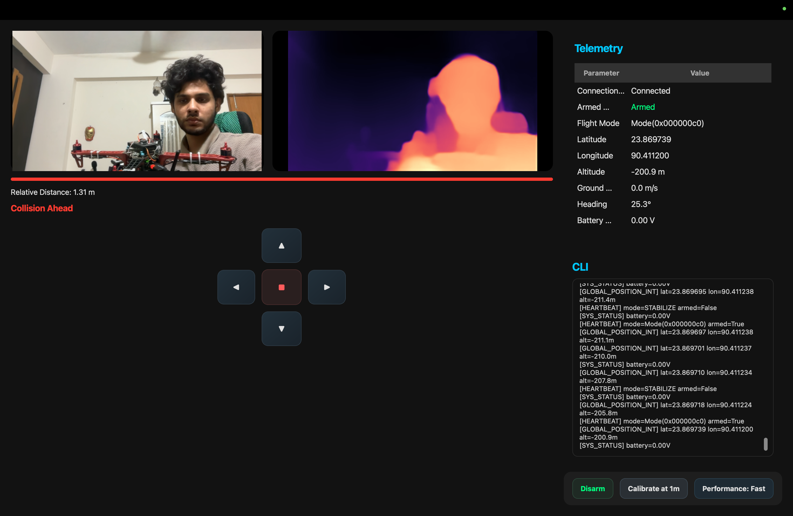
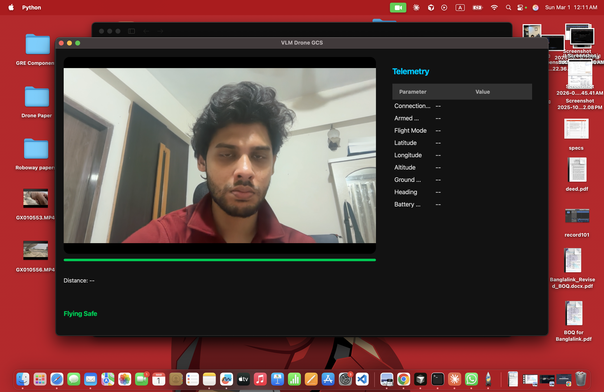

<p align="center">
  <h1 align="center">VLM-RME</h1>
  <p align="center">
    <strong>Vision-Language Model for Robotic Maneuver Estimation</strong>
  </p>
  <p align="center">
    Real-time obstacle avoidance for autonomous drones using monocular depth estimation and large language model reasoning.
  </p>
  <p align="center">
    <a href="#demo">Demo</a> &bull;
    <a href="#installation">Install</a> &bull;
    <a href="#usage">Usage</a> &bull;
    <a href="#architecture">Architecture</a> &bull;
    <a href="#citation">Cite</a>
  </p>
</p>

---

## Overview

**VLM-RME** is a ground control station (GCS) that enables autonomous obstacle avoidance for ArduPilot-based UAVs by combining monocular depth estimation with large language model (LLM) reasoning. The system uses a single low-cost RGB camera to perceive the environment, estimates spatial depth using [Depth Anything V2](https://github.com/DepthAnything/Depth-Anything-V2), and queries GPT-4o to generate intelligent avoidance maneuvers grounded in real-time flight telemetry.

Unlike conventional approaches that require LiDAR, stereo cameras, or ultrasonic sensors, VLM-RME demonstrates that a **single monocular camera + a vision-language model** can provide effective reactive avoidance during autonomous waypoint missions.

## Problem Statement

GPS-guided autonomous drone missions assume a clear flight path between waypoints. In real-world environments, unexpected obstacles (trees, buildings, birds, vehicles) can appear in the planned trajectory. Commercial solutions rely on expensive ranging sensors (LiDAR: ~$500+, stereo depth cameras: ~$200+). This project investigates whether:

1. A **$10 USB webcam** with deep learning-based depth estimation can replace dedicated ranging hardware for forward obstacle detection.
2. A **large language model** (GPT-4o) can make contextually aware avoidance decisions using only numerical telemetry and depth readings, without requiring pre-programmed heuristic rules for every scenario.

## Key Features

- **Monocular Depth Estimation** -- Depth Anything V2 Small (24.8M params) running at 3 FPS on CPU, producing dense depth maps from a single RGB camera
- **Spatial Depth Analysis** -- Frame divided into left/center/right regions; 75th-percentile disparity used to focus on nearest obstacles
- **Dual Avoidance Modes**
  - *Auto*: Logic-based algorithm using spatial clearance, altitude, and attempt history
  - *GPT-4o*: LLM-guided decisions with natural language reasoning
- **Mission-Aware Avoidance** -- Seamless AUTO/GUIDED mode transitions during waypoint missions with clearance phase to prevent re-encounter
- **Interactive Mission Planning** -- Leaflet-based map with click-to-add waypoints, drag-to-reposition, and .waypoint file import/export
- **Full GCS Functionality** -- Telemetry, manual control, ARM/DISARM, mode switching, motor PWM monitoring

## Demo

<p align="center">
  <em>Demo video coming soon</em>
</p>

<!-- Replace with actual video link -->
<!-- [](https://youtu.be/YOUR_VIDEO_ID) -->

| Control Tab | Mission Planner |
|:-:|:-:|
|  |  |

> *Screenshots: Place your screenshots in `docs/` to display here.*

<a name="architecture"></a>
## System Architecture

```
                            +-----------------------+
                            |    USB Camera (RGB)   |
                            +----------+------------+
                                       |
                                  30 FPS capture
                                       |
                            +----------v------------+
                            |   Depth Anything V2   |
                            |   Small (24.8M params)|
                            |   Inference @ 3 FPS   |
                            +----------+------------+
                                       |
                              Dense Depth Map (H x W)
                                       |
                         +-------------+-------------+
                         |             |             |
                    Left Third    Center 20%    Right Third
                    (distance)   (75th %ile)   (distance)
                         |             |             |
                         +------+------+------+------+
                                |             |
                          forward_dist    spatial_clearance
                                |             |
                    +-----------v-------------v-----------+
                    |     Avoidance State Machine          |
                    |  IDLE -> DETECTED -> HOVER ->        |
                    |  EXECUTING -> COMPLETED -> CLEARANCE  |
                    +---+------------------+---------------+
                        |                  |
                   Auto Mode          GPT-4o Mode
                   (local logic)      (API call)
                        |                  |
                        +--------+---------+
                                 |
                          Velocity Command
                          (vx, vy, vz, duration)
                                 |
                    +------------v------------+
                    |   MAVLink (pymavlink)   |
                    |   Serial / UDP / TCP    |
                    +------------+------------+
                                 |
                    +------------v------------+
                    |   ArduPilot Autopilot   |
                    |   (Pixhawk / SITL)      |
                    +-------------------------+
```

### Avoidance State Machine

```
IDLE ──> OBSTACLE_DETECTED ──> HOVERING (1.5s) ──> EXECUTING (2-5s)
  ^                                                       |
  |                                                       v
  +──────── CLEARANCE (4s forward) <──── COMPLETED ───────+
                                              |
                                    (still blocked? retry)
```

The **clearance phase** is critical: after the avoidance maneuver, the drone flies *forward past the obstacle* for 4 seconds before resuming the mission. This prevents the deadlock scenario where the drone avoids laterally, resumes AUTO, and flies back into the same obstacle.

## Technologies

| Layer | Technology | Version |
|-------|-----------|---------|
| Interface | PyQt5 + PyQtWebEngine | 5.15+ |
| Depth Model | Depth Anything V2 Small | HuggingFace |
| Inference | PyTorch (CPU) | 2.6.0 |
| Language Model | OpenAI GPT-4o | API v1 |
| Drone Protocol | pymavlink (MAVLink 2.0) | 2.4.x |
| Computer Vision | OpenCV | 4.8+ |
| Map Rendering | Leaflet.js + CartoDB tiles | 1.9.4 |
| Flight Controller | ArduPilot ArduCopter | 4.x |

## Folder Structure

```
VLM-RME/
├── main.py                     # Entry point
├── requirements.txt            # Dependencies
├── README.md
├── .gitignore
│
├── app/
│   ├── main_window.py          # QTabWidget orchestration
│   │
│   ├── drone/                  # Flight control & planning
│   │   ├── mavlink_comm.py     # MAVLink connection + mission protocol
│   │   ├── avoidance.py        # 6-state avoidance state machine
│   │   └── mission.py          # Waypoint dataclass + file I/O
│   │
│   ├── vision/                 # Perception pipeline
│   │   ├── camera.py           # USB camera capture
│   │   ├── depth_model.py      # Depth Anything V2 inference + spatial analysis
│   │   └── gpt_advisor.py      # GPT-4o prompt engineering + API client
│   │
│   ├── threads/                # Concurrent processing
│   │   ├── drone_thread.py     # Telemetry polling (20 Hz)
│   │   ├── camera_thread.py    # Frame capture (30 Hz) + depth (3 Hz)
│   │   ├── avoidance_thread.py # Avoidance loop (20 Hz)
│   │   └── mission_thread.py   # Mission upload/download
│   │
│   └── widgets/                # UI components
│       ├── video_widget.py     # RGB feed + HUD overlay
│       ├── depth_widget.py     # Depth map visualization
│       ├── status_panel.py     # Telemetry display (14 fields)
│       ├── control_panel.py    # Connection + commands + config
│       ├── avoidance_log.py    # State machine log
│       ├── gpt_log.py          # LLM communication log
│       ├── mission_planner.py  # Map + waypoint table
│       ├── map_view.py         # QWebEngine + Leaflet bridge
│       └── map_assets/
│           └── map.html        # Leaflet map (CartoDB + ESRI tiles)
│
├── docs/                       # Documentation & figures
│   └── (screenshots, diagrams)
│
└── demo/                       # Demo videos & sample data
    └── (sample .waypoint files)
```

## Installation

```bash
git clone https://github.com/ArifinRafi/VLM-RME.git
cd VLM-RME
python -m venv venv
venv\Scripts\activate          # Windows
pip install -r requirements.txt
pip install torch==2.6.0 --index-url https://download.pytorch.org/whl/cpu --force-reinstall
python main.py
```

> **Note:** The Depth Anything V2 Small model (~100 MB) downloads automatically on first launch and is cached locally.

### GPT-4o Setup (Optional)

The GPT-4o advisor mode requires an OpenAI API key:

1. Obtain a key from [platform.openai.com](https://platform.openai.com/api-keys)
2. Enter the key in the app's **OpenAI API Key** field and click **Save**
3. The key is stored locally in `app_config.json` (gitignored, never committed)

## Usage

### Quick Start (with SITL Simulator)

```bash
# Terminal 1: Start ArduPilot SITL (or use Mission Planner > SIMULATION > Multirotor)
sim_vehicle.py -v ArduCopter --map --console

# Terminal 2: Run VLM-RME
python main.py
# Connect via: tcp:127.0.0.1:5763
```

### Autonomous Mission with Obstacle Avoidance

1. Upload a waypoint mission via Mission Planner (external)
2. Open VLM-RME, connect to the drone
3. Select avoidance mode (Auto or GPT-4o), click **Enable Avoidance**
4. Set mode to **AUTO**, click **ARM**
5. The drone flies the mission autonomously
6. When an obstacle appears within 1.0m:
   - Mode switches to GUIDED (verified, 5 retries)
   - Drone hovers for 1.5s to stabilize
   - Avoidance maneuver executes (2-5s)
   - Clearance phase flies forward 4s past the obstacle
   - Mode restores to AUTO, mission resumes

### Manual Control

Use **WASD** (forward/back/left/right), **QE** (yaw), **RF** (up/down) with adjustable speed slider.

## Research Significance

This work addresses the intersection of three active research areas:

1. **Monocular Depth Estimation for Robotics** -- Demonstrating that transformer-based depth models (Depth Anything V2) can provide actionable spatial awareness for real-time drone navigation, without stereo calibration or dedicated depth sensors.

2. **LLM-Guided Robotic Decision Making** -- Exploring whether large language models can serve as high-level planners for reactive obstacle avoidance, interpreting numerical sensor data and producing physically grounded velocity commands with natural language reasoning.

3. **Low-Cost Autonomous Navigation** -- Validating that a complete obstacle avoidance pipeline can operate on commodity hardware (USB webcam + consumer CPU), lowering the barrier to autonomous UAV deployment in resource-constrained environments.

### Key Contributions

- A **6-state avoidance architecture** with clearance phase that prevents oscillatory re-encounter with obstacles during waypoint missions
- **Spatial depth analysis** using percentile-based region estimation (left/center/right) from monocular depth maps for directional avoidance decisions
- **Dual-mode avoidance framework** combining deterministic logic and LLM reasoning, with automatic fallback between modes
- **Mission-aware mode management** with robust AUTO/GUIDED transitions verified through retry mechanisms

## Future Work

- [ ] On-device LLM inference (Llama/Phi) for offline GPT-like reasoning
- [ ] Multi-obstacle tracking with persistent obstacle map
- [ ] Visual SLAM integration for GPS-denied environments
- [ ] Stereo depth validation against monocular estimates
- [ ] Real-world outdoor flight testing and quantitative evaluation
- [ ] ROS 2 integration for multi-robot coordination

## Contributing

Contributions are welcome. Please open an issue to discuss proposed changes before submitting a pull request.

```bash
# Fork the repo, create a feature branch
git checkout -b feature/your-feature
# Make changes, commit, push
git push origin feature/your-feature
# Open a Pull Request
```

<a name="citation"></a>
## Citation

If you use this work in your research, please cite:

```bibtex
@software{rafi2026vlmrme,
  author    = {Rafi, Arifin},
  title     = {VLM-RME: Vision-Language Model for Robotic Maneuver Estimation},
  year      = {2026},
  publisher = {GitHub},
  url       = {https://github.com/ArifinRafi/VLM-RME}
}
```

## License

This project is developed for academic research purposes. Please contact the author for licensing inquiries.

---

<p align="center">
  <sub>Built by <a href="https://github.com/ArifinRafi">Arifin Rafi</a> | Roboway Technologies</sub>
</p>
